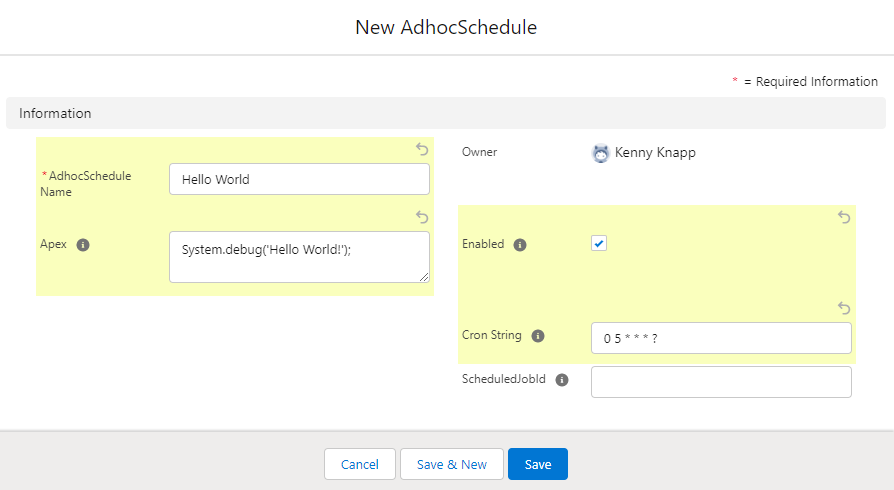
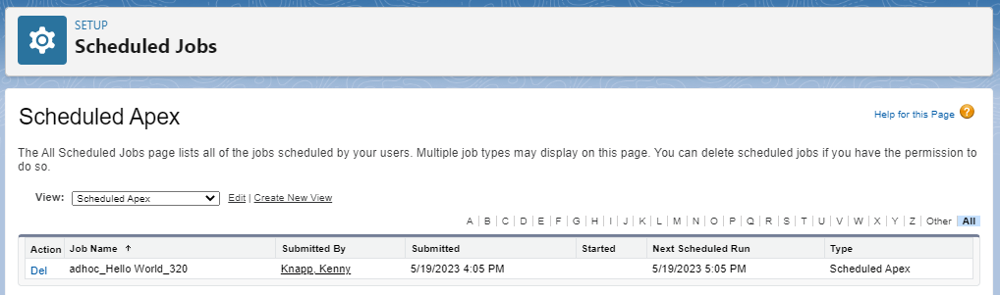
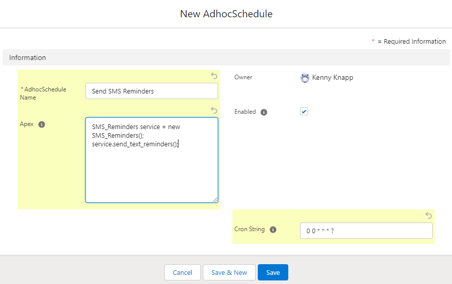

# Adhoc-Scheduled-Apex
A utility for creating adhoc Scheduled Apex jobs without implementing a new class.

- No need to implement `Schedulable` interface
- No deployments required for new jobs
- Automatically create scheduled jobs
- Ability to enable or disable scheduled jobs
- Edit cron schedule with automatic reschedule
- No need to unschedule jobs before deploying related apex classes

## Usage
To create a new scheduled job, simply create a new `AdhocSchedule__c` record. Specify the apex you want to run, 
the cron string to define the schedule, and save the record. As long as the `Enabled__c` field is TRUE, a new 
apex scheduled job will be created to run your specified apex.



> Scheduled jobs created using the tool will have `adhoc_` as the prefix to distinguish jobs that are being managed by the utility. The integer suffix is added to help reduce the potential for conflicting job names (duplicate names).

- Setting `Enabled__c` to FALSE will remove the scheduled job.
- Editing the `CronString__c` will remove the existing scheduled job and schedule a new job with the updated cron string
- Deleting the 'AdhocSchedule__c' record will remove the scheduled job
- UNDeleting an 'AdhocSchedule__c' record will add a new scheduled job _if_ the 'Enabled__c' checkbox is TRUE

## Examples

### Replace a simple Schedulable class
This is useful for a couple of reasons. If we're using best practices and seperating concerns by keeping our functional code in a Service class,
we often end up with very small Schedulable classes. Using the Adhoc Scheduled Apex utility:
- Reduce risk because we don't need to deploy the Schedulable class
- Save time since we don't need to write tests for this simple class
- Make changes to the apex without unscheduling the job first (and still, no deployment required)
- Make changes to the cron schedule more simply
```
global class Send_SMS_Reminders implements Schedulable {
  global void execute(SchedulableContext ctx) {
    SMS_Reminders service = new SMS_Reminders();
    service.send_text_reminders();
  }
}
```
Can be replaced with


## Future enhancements  
- Add error message to records when there's an apex exception
- Implement cron parsing to schedule jobs multiple times per hour (e.g. every X minutes)
- Build as sfdx package to simplify installation
- Extend to create adhoc Batch jobs without implementing the `Batchable` interface
- Change cron string to picklist with commonly used default strings (every hour, every day, etc.)?

